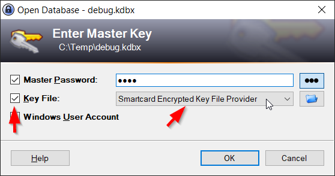
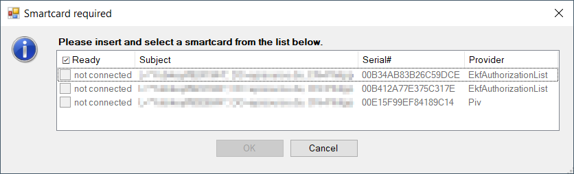
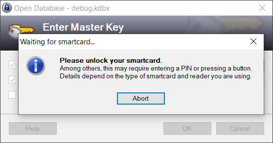
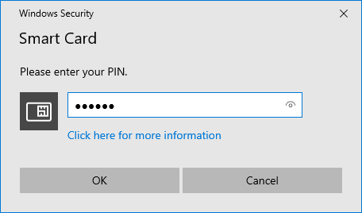
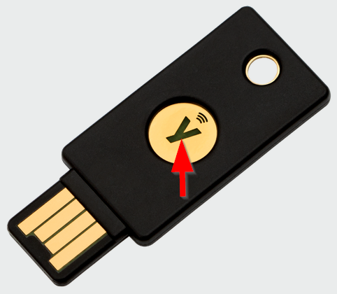
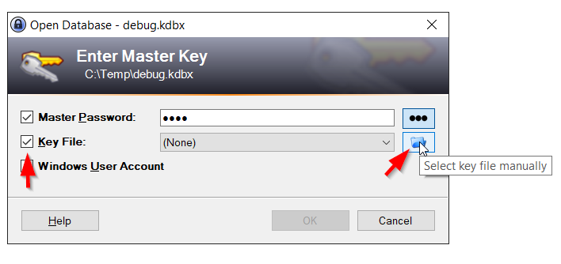
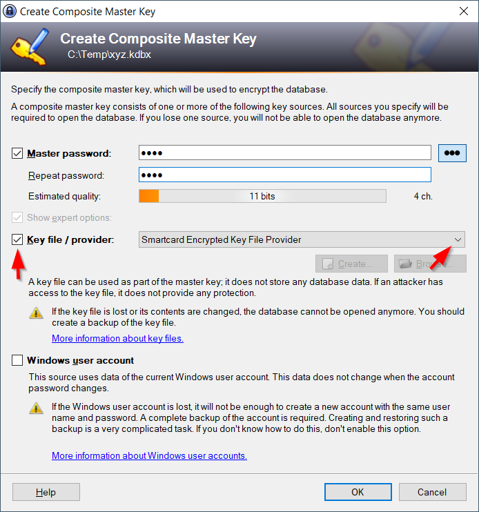
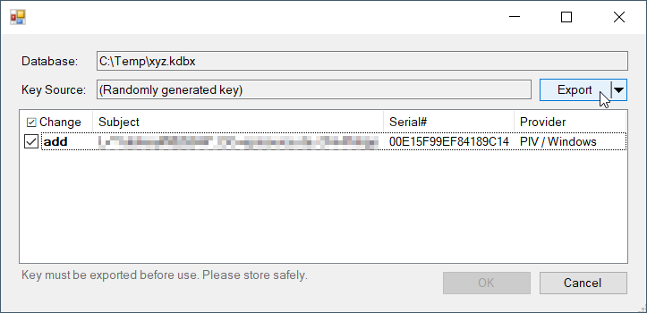
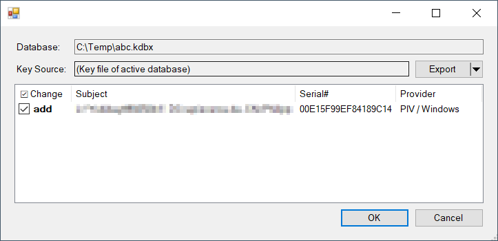
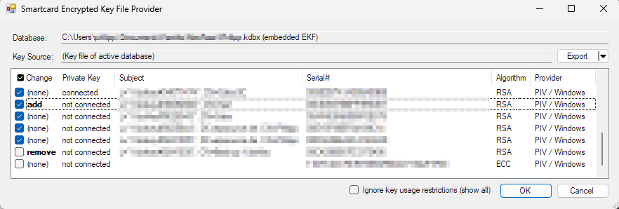

# Smartcard Encrypted Key File Provider Plugin for KeePass
This plugin adds support for using one or more smartcards as a second factor to unlock KeePass databases. It is implemented in a way that is fully compatible with built-in key files: an existing or newly created key file is encrypted using the public keys of one or more smartcards. The Encrypted Key File is saved next to the database file, and the user has the option to also save the corresponding plaintext key file in a safe location. When unlocking a database with the `Smartcard Encrypted Key File Provider`, the user is asked to insert/connect and unlock an authorized smartcard. Alternatively, the user can unlock the database with the plaintext key file, without needing the plugin to be installed. This ensures reliable access to the database even if the plugin is unavailable.

## Supported smartcards
In theory, this plugin supports any [PIV (Personal Identity Verification) compatible smartcard][1] using RSA certificates, or any card with an appropriate mini driver installed for RSA and ECC support. The Windows default PIV driver does not appear to support ECC; to use ECC certificates, an appropriate mini driver is required. Both the mini driver and the card must support the `Key Agree / Key Derive` operation for ECC compatibility with this plugin.

I recommend the YubiKey 5 series. These are easy to set up (see below), and I use them extensively with this plugin. Using RSA keys is the most portable option, as it doesn't require any drivers to be installed. ECC support requires the [YubiKey Smart Card Minidriver][9].

The following smartcards have been tested:
 - [YubiKey 5 Series](https://www.yubico.com/products/yubikey-5-overview/) (recommended; I use a YubiKey 5 NFC daily) - RSA & ECC
   * ECC & RSA3072/RSA4096 require the [YubiKey Smart Card Minidriver][9]
 - [Thales SafeNet eToken 5300 Series](https://www.thalestct.com/identity-access-management/etoken-5300/) & [Thales SafeNet IdPrime 930](https://cpl.thalesgroup.com/de/access-management/idprime-md-pki-smart-cards) ([SafeNet minidriver](https://supportportal.thalesgroup.com/csm?id=kb_article_view&sysparm_article=KB0016030) required) - RSA & ECC
   * When connected, this slows down querying key parameters of certificates backed by non-SafeNet tokens/cards. This noticeably increases the time needed to unlock KeePass and to modify Encrypted Key File authorization whenever other brands of tokens are also known to the host.
   * ECC521 requires plugin version 1.2.1 or newer
   * IdPrime tested with a ReinerSCT CyberJack RFID standard reader.
 - [Token2 Pin+ R3.3 Series USB](https://www.token2.com/shop/category/pin-release3-series) - RSA & ECC
   * Both RSA and ECC work without the [Token2 minidriver](https://www.token2.com/site/page/piv-management-tools-minidriver).
   * No touch policy is available for PIV.
 - [Token2 Pin+ R3.3 Series NFC Card](https://www.token2.com/shop/product/t2f2-nfc-card-pin-release3-nonbranded-and-printable) - RSA only
   * At least [Token2 Companion App v2.0.2 R6](https://www.token2.com/site/page/token2-companion-app-v2-user-manual) was required to initialize the card (v2.0.2 without R6 failed for me).
   * RSA works without the [Token2 minidriver](https://www.token2.com/site/page/piv-management-tools-minidriver). The minidriver makes ECC certificates available to Windows, but they are incompatible with this plugin.
   * ECC is incompatible with this plugin.
   * Tested with a ReinerSCT CyberJack RFID standard reader and a Dell Broadcom built-in NFC reader.
 - [SwissBit iShield Key 2 Pro](https://www.swissbit.com/de/produkte/security-produkte/ishield-key/) - effectively RSA only
   * Discovering ECC certificates requires the [SwissBit OpenSC minidriver](https://www.swissbit.com/de/produkte/security-produkte/ishield-key/#tool).
   * (2025-01) The SwissBit OpenSC minidriver [doesn't support the ECC Key Agree/Key Derive operation required for PIV slot 9A](https://github.com/swissbit-eis/OpenSC/blob/0.26.3-swissbit-piv/src/libopensc/pkcs15-piv.c#L426-L452).
   * (2025-01) Both the interactive iShield management tool and its command-line counterpart, `ikmcli`, fail to initialize slots other than 9A with ECC keys.
 - [Feitian ePass FIDO-NFC Plus](https://www.ftsafe.com/Products/FIDO/NFC) - RSA only
   * ECC fails with `One or more of the supplied parameters could not be properly interpreted` during decryption. I assume this device or its mini driver doesn't support Key Agree / Key Derive usage for ECC keys.
 - [Nitrokey 3A NFC, v1.8.3](https://docs.nitrokey.com/nitrokeys/features/piv/certificate_management) - ???
   * I haven't been able to set this up properly. Nitropy reports the PIV certificate as properly installed, but Windows does not recognize it (`certutil -scinfo`).
 - [Hirsch / Identiv FIDO2 NFC+](https://shop.hirschsecure.com/collections/fido2-security-keys/products/utrust-fido2-nfc-security-key) - ???
   * I haven't been able to get the PIV module of this token to work. [uTrust Token Manager v1.3.0](https://www.hirschsecure.com/products/identity-smart-card-readers/utrust-fido2-security-keys/utrust-key-manager-software) shows "Error generating certificate on Token" when initializing the PIV certificate. `certutil -scinfo` subsequently fails to access the key associated with the certificate ("cannot open key for reader"), and so does this plugin. Possibly a buggy PIV module.

## Is this safe? How does it work?
This plugin uses the native Win32 API* behind the [EnvelopedCms][2] .NET Framework class to encrypt the plaintext KeePass key file content. [EnvelopedCms][2] and its native counterparts implement [RFC 5652 Cryptographic Message Syntax (CMS)][3], which allows arbitrary content to be encrypted so that it can be decrypted by any authorized recipient. A randomly generated content-encryption key is used to protect the enveloped data (here, the plaintext KeePass key). This content-encryption key is itself encrypted using the public key of each authorized smartcard (recipient). As a result, any authorized smartcard can decrypt the content-encryption key and, in turn, the plaintext KeePass key. This plugin uses AES-256-CBC as the content-encryption algorithm. Encrypting the payload with a random content-encryption key is generally necessary to support content of arbitrary length; it isn't strictly required for this plugin's purposes, but assuming Microsoft's [EnvelopedCms][2] implementation and its native counterparts are correct, it does no harm. Most smartcards implement weaker asymmetric encryption for the content-encryption key than the AES-256-CBC used for the payload itself, so the weakest link in the chain is usually the smartcard side, not the symmetric encryption.

\*) The [EnvelopedCms][2] class in the .NET Framework does not support advanced features such as silent operation or the ECC Key Agree encryption scheme. Therefore, starting with v0.3.0, this plugin uses the native Win32 API to decode enveloped data, and starting with v1.2, it also uses the native Win32 API to encode enveloped data, in order to support the ECC Key Agree scheme. All of these changes remain fully compatible with the original [EnvelopedCms][2]-based implementation: EKF files from older plugin versions can be read by current versions, and vice versa.
# Usage
## Installation
Copy the pre-built `plgx` file into the KeePass plugin folder. Downloads are available as GitHub releases.

## Copying a database file
If you use `EXTERNAL` key file storage, remember to copy the `.ekf` file along with the `.kdbx` database file (see [Encrypted Key File location](#encrypted-key-file-location) for details). This isn't necessary when the encrypted key file is embedded in the kdbx file, which is the default since v1.4.

## Unlock database using smartcard
1. Open the database for the first time, or unlock the workspace.
2. Enter the `Master Password`, if one is set.
3. Tick the `Key File` option and select `Smartcard Encrypted Key File Provider` from the drop-down menu.
<br/>
4. Click OK. If no authorized smartcard, or more than one authorized smartcard, is connected to the computer, a selection dialog appears:
<br/>
5. Connect an authorized smartcard to the computer. The dialog closes automatically once the smartcard is recognized. If more than one authorized smartcard is already connected, select the smartcard to use and confirm the dialog.
6. The previously chosen smartcard is used to decrypt the key file. Depending on the smartcard, this may require user interaction and/or take a few moments. Abort if needed, or confirm the operation.
<br/>
    1. You will likely need to enter a PIN to unlock the smartcard. If so, the following dialog appears:
    <br/>
    <br/>Choosing `Remember PIN` stores the PIN in the Windows credential store. The stored PIN is encrypted with a per-instance key stored in the KeePass configuration file. This is useful, for example, when using a YubiKey where only the button should be needed to unlock the key.
    2. When using a YubiKey or similar device, you might need to confirm the private key operation by pressing a hardware button. YubiKeys like the one shown below blink while waiting for confirmation.
    <br/>
7. Done: assuming the correct `Master Password` was entered, the database is now unlocked!


## Unlock database using (backup) key file
Nothing special here — this doesn't require the plugin to be installed at all:



## Create new database with encrypted key file
1. Open the `New` wizard as usual and choose a file name and location. Eventually, the `Create Composite Master Key` dialog appears:
<br/>
2. Activate `Show expert options`, select at least `Key file / provider`, and choose `Smartcard Encrypted Key File Provider`.
3. Click OK to continue. The dialog shown below appears:
<br/>
    1. At least one compatible smartcard must be selected and authorized.
    2. A randomly generated key must be exported before the dialog can be confirmed.
    3. A randomly generated key file corresponds to a 256-bit key in binary representation. Explicitly generate a random key via the drop-down menu next to the `Export` button to provide additional entropy.
    4. The drop-down menu next to the `Export` button provides further options, such as importing an existing plaintext key file.
4. Finish creating the new database file by clicking OK. No private key operation is needed for this step, so no prompt to unlock the smartcard is shown.
5. [Confirm](#unlock-database-using-backup-key-file) that the exported backup key file can be used to unlock the database.

## Add Encrypted Key File to existing database
Note: If the current database already uses a plaintext key file in addition to the master password, you can also proceed as described in [Change authorization](#change-authorization). Using the `Change Master Key` dialog as described below always works.

1. Open the `Change Master Key...` dialog from the `File` menu.
<br/>
2. Activate `Show expert options`, select at least `Key file / provider`, and choose `Smartcard Encrypted Key File Provider`.
3. The dialog shown below appears:
<br/>
    1. At least one compatible smartcard must be selected and authorized.
    2. If a key file was already used for the current database, that same key is stored in the Encrypted Key File by default. Otherwise, a randomly generated key is used by default.
    3. A randomly generated key file corresponds to a 256-bit key in binary representation. Explicitly generate a random key via the drop-down menu next to the `Export` button to provide additional entropy.
    4. A randomly generated key must be exported before the dialog can be closed.
    5. The drop-down menu next to the `Export` button provides further options, such as importing an existing plaintext key file.
 4. Finish creating the new database file by clicking OK. No private key operation is needed for this step, so no prompt to unlock the smartcard is shown.
 5. [Confirm](#unlock-database-using-backup-key-file) that the exported backup key file, or the previously used key file, can be used to unlock the database.

## Change authorization
1. Open and unlock a database using an encrypted or plaintext key file.
2. In the `Tools` menu, select `Edit Encrypted Key File`. A dialog like the one below appears:
<br/>
   1. All currently authorized smartcards are preselected.
   2. Smartcards that are currently authorized but not known to the current computer are reported as having the `unknown / EKF` provider. Authorization of these smartcards is preserved by default.
   3. Smartcards known to the current computer that are not yet authorized are available for manual selection.
   4. Uncheck entries to revoke authorization for the corresponding smartcards.
   5. Check previously unchecked entries to grant authorization.
   6. Use the `Export` button to export the encrypted key to a plaintext backup key file.
   7. The encrypted key itself cannot be changed from within this dialog (the extended features provided by the drop-down menu next to the `Export` button are disabled). Use `Change Master Key...` from the `File` menu instead to change the encrypted key.

# YubiKey 5 PIV setup

## Activate PIV interface of YubiKey 5 series tokens
**Prerequisites:** a single YubiKey connected to your computer; [Yubico Authenticator (graphical interface)][4]. No need to install the [YubiKey Smart Card Minidriver][9] (only required for ECC certificates).
1. Start the Yubico Authenticator application.
2. Select `Toggle Applications` in the right sidebar.
3. Tick `PIV` for the USB interface, the NFC interface, or both.
4. Click `Save`.

## Basic setup using graphical tools
**Prerequisites:** a single YubiKey connected to your computer; the PIV interface has been activated ([see above](#activate-piv-interface-of-yubikey-5-series-tokens)); [Yubico Authenticator (graphical interface)][4]. No need to install the [YubiKey Smart Card Minidriver][9] (only required for ECC certificates).

Basic setup is possible using graphical tools only. It uses Yubico's default configuration to unlock the token (e.g., PIN for slot 9a; multiple operations require only a single PIN entry).

1. Start the Yubico Authenticator application.
2. Select `Certificates` in the left sidebar.
3. Recommended: In the right sidebar, change the well-known default PIN (`Change PIN`), PUK (`Change PUK`), and management key (`Management Key`). Further [information about the PIN and management key][5], including the defaults, is available from Yubico.
4. Select certificate `9a - Authentication`.
5. In the right sidebar, click `Generate Key` to open the PIV certificate wizard.
6. Generate a self-signed certificate, or import one:
   - The certificate's distinguished name (subject) is used to identify the YubiKey within KeePass. Choose a name that helps you identify the specific YubiKey; consider including the YubiKey's serial number (optional).
   - Pay attention to the expiry date!
   - **Important: when using ECC algorithms, the [YubiKey Smart Card Minidriver][9] is required. RSA also works with Windows' built-in drivers.**

## Advanced setup using command line tools
**Prerequisites:** a single YubiKey connected to your computer; the command-line [YubiKey PIV Tool][8] ([download][9]). No need to install the YubiKey Smart Card Minidriver (only required for ECC certificates).

Advanced setup requires the command-line tools provided by Yubico. Compared with basic setup, advanced configuration allows more variants for unlocking the YubiKey (PIN policy, touch policy). For example, the token can be configured to unlock with PIN + button press, button only, and more. Yubico provides [a PDF guide][7] to the YubiKey PIV Tool that gives a good overview of the available configuration options.

Below are example commands to replace the certificate in slot 9a with a newly created self-signed certificate and a custom unlock configuration (PIN policy, touch policy). Note, however, that PIN policy is currently not honored by Windows' built-in drivers or the YubiKey minidriver: the PIN is always requested on the first private key operation. Touch policy, however, is fully supported.

1. Delete the existing key pair and securely create a new one (the private key is stored exclusively inside the hardware).
   <br/>`$ yubico-piv-tool.exe -s9a -k -adelete-certificate -agenerate --pin-policy=<pin-policy> --touch-policy=<touch-policy> --output=c:\temp\yubi_pub.tmp`
   <br/> - Possible values for `pin-policy` are: `never` (private key operations are always permitted without a PIN), `once` (private key operations require the PIN to be entered once per session), `always` (every private key operation must be confirmed with a PIN).
   <br/> - Possible values for `touch-policy` are: `never` (private key operations are always permitted without a button press), `cached` (private key operations require the hardware button to be pressed once per session), `always` (every private key operation must be confirmed by a hardware button press).
   <br/> - Any combination of `pin-policy` and `touch-policy` is supported. The PIV tool uses its built-in default configuration if these parameters are omitted; this default depends on the chosen slot and matches the one used by the graphical tool.
2. Create a self-signed certificate using the key pair from the previous step.
   <br/>`$ yubico-piv-tool.exe -s9a -averify-pin -aselfsign-certificate -S"<subject>" --valid-days=<valid-days> --input=c:\temp\yubi_pub.tmp --output=c:\temp\yubi_cert.tmp`
   <br/>`subject` is a distinguished name following X.509 certificate rules. OSF syntax (using `/` as separator) can be used, e.g., `/CN=YourName/DC=domain/DC=example/DC=com/L=Yubikey#42424242/` (replace with appropriate values, such as your name, domain, and YubiKey serial number).
   <br/>`valid-days` controls the certificate's validity period; for example, `18250` is roughly 50 years. The maximum supported value is roughly `24850`, since this number is [internally converted to seconds by the piv-tool](https://github.com/Yubico/yubico-piv-tool/blob/yubico-piv-tool-2.7.3/tool/yubico-piv-tool.c#L1376), and the resulting argument to [X509_gmtime_adj](https://docs.openssl.org/3.3/man3/X509_cmp_time/) overflows for larger values, producing negative offsets.
   <br/>Note: This step must be confirmed by pressing the YubiKey button when it starts blinking!
3. Import the certificate into the YubiKey and renew the CHUID (required for Windows to pick up the new certificate).
  <br/>`$ yubico-piv-tool.exe -k -s9a  -aimport-certificate --input=c:\temp\yubi_cert.tmp -aset-chuid -astatus`
4. Disconnect and reconnect the YubiKey.

# Build
This project is best built using JetBrains Rider, though plain MSBuild or Visual Studio should also work. Debug builds produce only the plugin DLL. Release builds additionally produce a [plgx plugin file][10] with improved compatibility. Pre-built `plgx` files are available as GitHub releases.

## Build plgx without devtools
Building the plgx plugin file requires only PowerShell — no development tools needed:
```posh
$ cd <project dir containing .csproj>
$ .\build-plgx-project.ps1 -csproj .\SmartcardEncryptedKeyFile.csproj -outdir .\bin\Release\Plugins -objdir .\obj\Release\plgx -plgxArgs "--plgx-prereq-kp:2.44,--plgx-prereq-net:4.7,--plgx-prereq-os:Windows"
```

Important: this script deletes the contents of `outdir` and `objdir` without asking for confirmation. Choose these paths carefully!

# Advanced options
## Encrypted Key File location
Starting with v1.4 of this plugin, the Encrypted Key File is normally embedded in the kdbx file (as a [public custom data header field][14]).

Prior to v1.4, the Encrypted Key File was always written to a companion file, named after the database file with a `.ekf` extension.

The `Tools > Edit Encrypted Key File` dialog automatically migrates between formats: there's no need to change the authorization — just open the dialog and select `OK`.

Use the advanced configuration below in `KeePass.config.xml` to switch between `KDBX` embedded storage (the v1.4 default) and the `EXTERNAL` companion file:

```xml
<Configuration>
    <Custom>
       ...
       <Item>
          <Key>EpiSource.KeePass.Ekf.PreferredEkfStore</Key>
          <Value>KDBX</Value><!-- v1.4 default: embed EKF into kdbx file -->
          <!-- <Value>EXTERNAL</Value>--><!-- pre v1.4 default: use companion file to store EKF -->
       </Item>
       ...
    </Custom>
</Configuration>
```

## Force native smartcard PIN prompt
By default, a custom PIN prompt is used. This custom prompt enables secure desktop support and provides the option to remember encrypted/obfuscated PINs in the Windows credential store.

Add the snippet below to `KeePass.config.xml` to revert to the Windows built-in smartcard PIN prompt:

```xml
<Configuration>
    <Custom>
       ...
       <Item>
          <Key>EpiSource.KeePass.Ekf.UseNativePinDialog</Key>
          <Value>true</Value>
       </Item>
       ...
    </Custom>
</Configuration>
```
## Require strict RFC5753 (ECC) parameters
[RFC5753](https://datatracker.ietf.org/doc/rfc5753/) recommends parameters for the key-agree scheme used with ECC encryption.
Setting the option below configures the plugin to strictly adhere to these recommendations.

With this disabled (the default), the following deviations are allowed:
 - Using a SHA384-based key derivation function for ECC521 curves (instead of the recommended SHA512). This is required
   for compatibility with all known Windows builds; otherwise, authorizing a smartcard using ECC521 curves fails with
   an invalid parameter error. See also #3.

Add the snippet below to `KeePass.config.xml` to strictly follow the RFC5753 parameters.

```xml
<Configuration>
    <Custom>
       ...
       <Item>
          <Key>EpiSource.KeePass.Ekf.StrictRfc5753</Key>
          <Value>true</Value>
       </Item>
       ...
    </Custom>
</Configuration>
```

## Threat protection interference ("Failed to start unblocker process. Wasn't ready within ...s!") - Non-Default Unblocker Bootstrap mode
If smartcard operations fail with the error "Failed to start unblocker process. Wasn't ready within ...s!", you are
likely in a company-controlled environment where the smartcard worker process is being blocked by your threat
protection system.

All smartcard operations are executed using an isolated worker process. This is necessary because these (potentially)
long-running operations couldn't be canceled if run from the main KeePass process. Refer to [Unblocker][11] for
technical details. The way the assembly for the smartcard process is created might interfere with your threat
protection system, leading to warnings or malfunctions of this plugin.

This is especially relevant in company environments. If you're using a "default" Windows installation with the
built-in Defender, you've likely run into a different issue — feel free to open an issue. Otherwise, try one of the
tweaks below:

1. `CustomBootstrapper` (default): a bootstrapper assembly is created dynamically for the worker process.
   The unblocker component tries to create this assembly in the [KeePass plugin cache][12] directory; if that fails,
   the current user's default temporary directory is used instead. The assembly is recreated (with a changing hash)
   whenever the KeePass version, the EKF plugin version, the KeePass installation directory, or the
   [KeePass plugin cache][12] directory changes.
2. `CustomBootstrapperNoSideBySide`: like the previous option, but no attempt is made to create the assembly in the
   KeePass plugin cache directory.
3. `InstallUtilTrampoline`: the [.NET Framework's built-in InstallUtil][13] is used to load the pieces needed for the
   worker process. A dynamically created "trampoline" assembly loads all required dependencies from their current
   (absolute) location. The unblocker component tries to create this assembly in the [KeePass plugin cache][12]
   directory; if that fails, the current user's default temporary directory is used instead. The assembly is
   recreated (with a changing hash) whenever the KeePass version, the EKF plugin version, the KeePass installation
   directory, or the [KeePass plugin cache][12] directory changes.
4. `InstallUtilTrampolineNoSideBySide`: like the previous option, but no attempt is made to create the assembly in
   the KeePass plugin cache directory.
5. `InstallUtilPlain`: the [.NET Framework's built-in InstallUtil][13] is used without a dynamically created
   assembly. For this to work, the plugin's `EpisourceKeePassEkf.dll` **must be located in the same directory as
   `KeePass.exe`**!

Add the snippet below to `KeePass.config.xml`, with your preferred option as the `Value`.

```xml
<Configuration>
    <Custom>
       ...
       <Item>
          <Key>EpiSource.KeePass.Ekf.UnblockerBootstrapMode</Key>
          <Value>[replace with option described above]</Value>
       </Item>
       ...
    </Custom>
</Configuration>
```

## Debug options
To get debug output and stack traces, invoke KeePass with the command-line option `--debug`. Use `--debug --debug-no-unblocker` to additionally disable the unblocker for testing purposes. Be aware: without the unblocker, the KeePass UI freezes during smartcard operations. Disabling the unblocker is required to debugger-step through smartcard-related operations. `--alloc-console` is useful to force allocation of a console (so you can actually see the output) when running outside an IDE.

# Known Issues & Limitations
1. Non-local databases have not been tested, but might work as well.
2. KeePass's built-in synchronization does not synchronize changes related to the Encrypted Key File (e.g., access granted to an additional smartcard).
3. Smartcard operations / unlocking an Encrypted Key File fails with the message _"Failed to start unblocker process. Wasn't ready within ...s!"_ in some company environments with a strict threat protection system. Refer to the custom configuration options above for solutions. This message also appears when using the `InstallUtilPlain` bootstrapper configuration if the `.dll` files' [downloaded-from-internet flag is not cleared](https://raw.githubusercontent.com/episource/Keepass-SmartcardEncryptedKeyFile/refs/heads/master/doc/plugin-dll-clear-downloaded-flag.png).
4. Smartcard operations / unlocking an Encrypted Key File fails (with an exception dialog) if Yubico Authenticator is running at the same time (note: this only occurs when using the Windows built-in smartcard driver; it does not occur if the YubiKey minidriver is installed).


[1]: https://csrc.nist.gov/pubs/sp/800/73/pt1/5/final
[2]: https://docs.microsoft.com/en-us/dotnet/api/system.security.cryptography.pkcs.envelopedcms.encrypt?view=netframework-4.8
[3]: https://tools.ietf.org/html/rfc5652
[4]: https://www.yubico.com/products/yubico-authenticator/
[5]: https://docs.yubico.com/yesdk/users-manual/application-piv/pin-puk-mgmt-key.html
[6]: https://developers.yubico.com/PIV/Introduction/Certificate_slots.html
[7]: https://docs.yubico.com/software/yubikey/tools/pivtool/webdocs.pdf
[8]: https://github.com/Yubico/yubico-piv-tool
[9]: https://www.yubico.com/support/download/smart-card-drivers-tools/
[10]: https://keepass.info/help/v2_dev/plg_index.html#plgx
[11]: https://github.com/episource/unblocker
[12]: https://keepass.info/help/v2/plugins.html#cache
[13]: https://learn.microsoft.com/en-us/dotnet/framework/tools/installutil-exe-installer-tool
[14]: https://keepass.info/help/kb/kdbx.html#header
