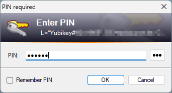

# Smartcard Encrypted Key File Provider Plugin for KeePass
This plugin adds support for using (multiple) smartcards as second factor to unlock KeePass databases. This is implemented in a manner, that is fully compatible with built-in key files: An existing or newly created key file is encrypted using public keys of one or many smartcards. The encrypted key file is saved next to the database file, while the user is given the possibility to save the corresponding plaintext key file in a safe location. When unlocking a database using the  `Smartcard Encrypted Key File Provider`, the user is asked to insert/connect and unlock an authorized smartcard. As alternative, the user can also unlock the database using the plaintext key file without need for the corresponding plugin to be installed. Hence, access to the database is granted reliably, even if this plugin should not available.

## Supported smartcards
In theory, this plugin supports any [PIV (Personal Identity Verification) compatible smartcard][1] or cards with appropriate mini driver installed. The card must support RSA or ECC public key encryption. 

I'm recommending YubiKey 5 series. These are easy to setup (see below) and I'm intensively using them with this plugin.

The following smartcards have been tested:
 - YubiKey 5 NFC (recommended, this is what I'm using daily)
 - Thales SafeNet eToken 5300 Series ([SafeNet minidriver](https://supportportal.thalesgroup.com/csm?id=kb_article_view&sysparm_article=KB0016030) required)

## Is this safe? How does it work?
This plugin uses the native Win32 API* behind [EnvelopedCms][2] .Net framework class for encrypting the plaintext KeePass key file content. [EnvelopedCms][2] and its native counterparts are implementations of [RFC 5652 Cryptographic Message Syntax (CMS)][3]: It permits encryption of arbitrary content to be decrypted by any authorized recipient. A random content encryption key is used to protect the enveloped data (here: KeePass plaintext key). The single content encryption key is again encrypted using the public keys belonging to the list of authorized smartcards (recipients). Thus any authorized smartcard can decrypt the content encryption key and in turn permits decryption of the plaintext KeePass key. This plugin selects AES-256-CBC as content encryption algorithm. The intermediate encryption of the payload using a random content encryption is generally needed to support arbitrary length content. It's not strictly needed for the purpose of this plugin, but assuming [EnvelopedCms][2] and its native counterparts were properly implemented by Microsoft, it should be of no harm. Most smartcards implement weaker asymmetric encryption (used to encrypt the content encryption key) compared with the intermediate encryption using AES-256-CBC. Thus the weakest point of the chain will usually be on the smartcard side and not the intermediate symmetric encryption.

*) The [EnvelopedCms][2] class of .Net Framework does not support advanced features like silent operation and ECC Key Agree encryption scheme. Therefore, starting with v0.3.0 of this plugin, native Win32 API is used for decoding enveloped data. Starting with v1.2 of this plugin, also encoding is done using Win32 API, in order to support ECC Key Agree scheme. All these changes are fully compatible with the initial [EnvelopedCms][2] based implementation. EKF files from older plugin version can be read by current versions and vice-versa.
# Usage
## Installation
Just copy the pre-built `plgx` file into the KeePass plugin folder. Downloads available as github release.

## Copying a database file
Remember to copy the `.ekf`-file along with the `.kdbx` KeePass database.

## Unlock database using smartcard
1. Open database for the first time or unlock workspace
2. Enter `Master Password`, if any
3. Tick `Key File` option and select `Smartcard Encrypted Key File Provider` from the drop down menu
<br/>
4. Click OK. If no authorized smartcard or more than one authorized smartcard are connected to the computer, a selection dialog will appear:
<br/>
5. Connect an authorized smartcard to the computer. The dialog will close automatically once the smartcard is recognized. If more than one authorized smartcard is already connected, select the smartcard to be used and confirm the dialog.
6. The previously chosen smartcard is used to decrypt the key file. Depending on the actual smartcard being used, this is likely to require user interaction and/or may take a few moments. Feel free to abort, else confirm the operation.
<br/>
    1. It is likely that a PIN must be entered to unlock the smartcard. Therefore, the following dialog might popup:
    <br/>
    <br/>Chosing `Remeber PIN` stores the PIN in the windows credential store. The stored PIN is encrypted with a per-instance key stored in the keepass configuration file. This is useful e.g. when using a YubiKey and only the button should be needed to unlock the key.
    2. When using a YubiKey or similiar device, it might be necessary to confirm the private key operation by pressing a hardware button. YubiKeys like the one shown below will blink when the device is waiting for confirmation.
    <br/>
7. All done: Assuming the correct `Master Password` was entered, the database has finally been unlocked!


## Unlock database using (backup) key file
Nothing special here, doesn't require the plugin to be installed at all:


## Create new database with encrypted key file
1. Open `New` wizzard as usual and choose a file name & location. Eventually the `Create Composite Master Key` dialog will show:
<br/>
2. Activate `Show expert options` and select at least `Key file / provider` and choose `Smartcard Encrypted Key File Provider`
3. Click OK to continue. The dialog shown below will appear:
<br/>
    1. At least one compatible smartcard must be selected / authorized.
    2. A randomly generated key must be exported before the dialog can finally be created.
    3. A randomly generated key file corresponds to a 256bit key in binary representation. Explicitly generate a random key via the drop down menu next to the `Export` button to provide additional entropy.
    4. The drop down menu next to the Export button provides further options like importing an existing plaintext key file.
4. Finish creation of the new database file by clicking OK. No private key operation is needed for this, therefor no prompt to unlock the smartcard will be shown.
5. [Confirm](#unlock-database-using-backup-key-file) that the exported backup key file can be used to unlock the database.

## Add encrypted key file to existing database
Note: If the current database already uses a plaintext key file in addition to the master password, it is also possible to proceed as described in section [change authorization](#change-authorization). Using the `Change Master Key` dialog as described below will always work.

1. Open `Change Master Key...` dialog from `File` menu
<br/>
2. Activate `Show expert options` and select at least `Key file / provider` and choose `Smartcard Encrypted Key File Provider`
3. The dialog shown below appears:
<br/>
    1. At least one compatible smartcard must be selected / authorized.
    2. If a key file was already used for the current database, the same key will be stored in the encrypted key file by default. Else an randomly generated key will be the default.
    3. A randomly generated key file corresponds to a 256bit key in binary representation. Explicitly generate a random key via the drop down menu next to the `Export` button to provide additional entropy.
    4. A randomly generated key must be exported before the dialog can finally be created.
    5. The drop down menu next to the Export button provides further options like importing an existing plaintext key file.
 4. Finish creation of the new database file by clicking OK. No private key operation is needed for this, therefor no prompt to unlock the smartcard will be shown.
 5. [Confirm](#unlock-database-using-backup-key-file) that the exported backup key file or the previously used key file can be used to unlock the database.

## Change authorization
1. Open and unlock a database using an encrypted or plaintext key file
2. Within `Tools` menu select `Edit Encrypted Key File`. A dialog like below shows up:
<br/>
   1. All currently authorized smartcards are preselected.
   2. Smartcards that are currently authorized, but not known to the current computer, are reported as having  `unknown / EKF` provider. Authorization of these smartcards will be preserved by default.
   2. Smartcards known to the current computer, that are not yet authorized, are available for manual selection.
   3. Uncheck entries to revoke authorization for the corresponding smartcards.
   4. Check previously unchecked entries to grant authorization.
   5. Use the export button to export the encrypted key to a plaintext backup key file.
   6. The encrypted key itself cannot be changed from within this dialog (extended features provided by the drop down menu next to the `Export` button are disabled) - use `Change Master Key...` from `File` menu instead to change the encrypted key.

# YubiKey 5 PIV setup

## Activate PIV interface of YubiKey 5 series tokens
**Prerequisites:** single YubiKey connected to your computer; [Yubico Authenticator (graphical interface)][4]; no need to install YubiKey Smart Card Minidriver (only required for ECC certificates)
1. Start YubiKey Authenticator application
2. Select `Toggle Applications` in right sidebar
3. Tick `PIV` for either USB, NFC or both interfaces
4. Click `Save`

## Basic setup using graphical tools
**Prerequisites:** single YubiKey connected to your computer; PIV interface has been activated ([see above](#activate-piv-interface-of-yubikey-5-series-tokens)); [Yubico Authenticator (graphical interface)][4]; no need to install [YubiKey Smart Card Minidriver][9] (only required for ECC certificates, but these are not yet supported by this plugin)

Basic setup is possible using graphical tools only. Yubico default configuration to unlock the token is used (e.g. PIN for slot 9a; multiple operations only require single pin input).

1. Start Yubico Authenticator application
2. Select `Certificates` in left sidebar
3. Recommended: Within right sidebar change well-known default PIN (`Change PIN`), PUK (`Change PUK`) and Management Key (`Management Key`); further [information about pin and management key][5], including defaults, is available from yubico
4. Select certificate `9a - Authentication`
5. Within right sidebar, click `Generate Key` to open PIV certificate wizzard
6. Generate self signed certificate or import certificate;
   - The certificate's distinguished name (subject) is used to identify the yubikey within keepass. Select a name, that helps you to identifý the specific YubiKey. Consider including the YubiKey's serial number (optional).
   - Take care of the expiry date!
   - **Important: when using ECC algorithms, the [Yubikey Smartcard Mini driver][9] is required. RSA works with windows builtin drivers, too!**

## Advanced setup using command line tools
**Prerequisites:** single YubiKey connected to your computer; command line [YubiKey PIV Tool][8] ([download][9]); no need to install YubiKey Smart Card Minidriver (only required for ECC certificates, but these are not yet supported by this plugin)

Advanced setup requires using command line tools provided by yubico. Compared with basic setup, advanced configuration permits more variants for unlocking the YubiKey (pin-policy, touch-policy). E.g. the token can be configured for unlocking with PIN+button press, only button, and more. Yubico provides [a pdf guide][7] to the YubiKey PIV Tool, that gives a good overview over available configuration options.

Below are example commands to replace the certificate in slot 9a with a newly created self-signed certificate and custom unlock configuration (pin-policy, touch-policy). Note however, that pin-policy is currently not honored by windows builtin drivers and yubikey's minidriver. Pin will always be asked when performing the first private key operation. Touch-operations are fully supported, though.

1. Delete existing key pair and securely create new one (private key exclusively stored inside hardware)
   <br/>`$ yubico-piv-tool.exe -s9a -k -adelete-certificate -agenerate --pin-policy=<pin-policy> --touch-policy=<touch-policy> --output=c:\temp\yubi_pub.tmp`
   <br/> - Possible values for `pin-policy` are: `never` (private key operations are always permitted without PIN), `once` (private key operations require pin to be entered once per session), `always` (any private key operation must be confirmed with PIN input)
   <br/> - Possible values for `touch-policy` are: `never` (private key operations are always permitted without button press), `cached` (private key operations require the hardware button to be pressed once per session), `always` (any private key operation must be confirmed by a hardware button press)
   <br/> - Any combination of `pin-policy` and `touch-policy` is supported. Piv tool uses builtin default configuration if these parameters are omitted. Built-in configuration depends on the slot chosen and is equal to the one used by the graphical tool.  
2. Create self-signed certificate using key pair from step above
   <br/>`$ yubico-piv-tool.exe -s9a -averify -aselfsign-certificate -S"<subject>" --valid-days=<valid-days> --input=c:\temp\yubi_pub.tmp --output=c:\temp\yubi_cert.tmp`
   <br/>`subject` is a distinguished name following x.509 certificate rules. OSF-Syntax (`/` is separator) can be used. E.g.:  `/CN=YourName/DC=domain/DC=example/DC=com/L=Yubikey#42424242` (replace with apropriate values, such as your name, domain and serial number of your YubiKey)
   <br/>`valid-days` controls validity of the certificate. E.g. `18250` is roughly equal to 50 years.
   <br/>Note: This step must be confirmed by pressing the YubiKey button when it starts blinking!
3. Import certificate into YubiKey and renew chuid (required for windows to pick up the new certificate)
  <br/>`$ yubico-piv-tool.exe -k -s9a  -aimport-certificate --input=c:\temp\yubi_cert.tmp -aset-chuid -astatus`
4. Disconnect and reconnect YubiKey
  
# Build
This project is best built using JetBrains Rider, but plain msbuild or Visual Studio should work as well. For debug builds, only the plugin dll is built. When using release configuration, a [plgx plugin file][10] with improved compatibility is built as well. Pre-built `plgx` builds are available as github releases.

## Build plgx without devtools
Building the plgx plugin file is possible using powershell only. No development tools needed:
```posh
$ cd <project dir containing .csproj>
$ .\build-plgx-project.ps1 -csproj .\SmartcardEncryptedKeyFile.csproj -outdir .\bin\Release\Plugins -objdir .\obj\Release\plgx -plgxArgs "--plgx-prereq-kp:2.44,--plgx-prereq-net:4.7,--plgx-prereq-os:Windows"
```

Important warning: This script cleans `outdir` and `objdir` without asking for confirmation! Carefully choose the paths you enter here!

# Advanced options
## Force native smartcard PIN prompt
Per default a custom PIN prompt is used. The custom PIN prompt enables secure desktop support and provides an option to remember encrypted/obfuscated PINs in the windows credential store.

Add below snippet to `KeePass.config.xml` to revert to windows builtin smartcard PIN prompt:

```xml
<Configuration>
    <Custom>
       <Item>
          <Key>EpiSource.KeePass.Ekf.UseNativePinDialog</Key>
          <Value>true</Value>
       </Item>
    </Custom>
</Configuration>
```

# Known Issues & Limitations
1. Non-Local databases have not been tested, but might work as well.
2. KeePass builtin synchronization won't synchronize changes related to the encrypted key file (e.g. access granted to additional smartcard).
3. Smart Card operations / unlocking an encrypted key file fails (with Exception dialog) if YubiKey Authenticator is running in parallel (note: only when using windows builtin smartcard driver, issue does not occur if YubiKey minidriver is installed)


[1]: https://csrc.nist.gov/pubs/sp/800/73/pt1/5/final
[2]: https://docs.microsoft.com/en-us/dotnet/api/system.security.cryptography.pkcs.envelopedcms.encrypt?view=netframework-4.8
[3]: https://tools.ietf.org/html/rfc5652
[4]: https://www.yubico.com/products/yubico-authenticator/
[5]: https://docs.yubico.com/yesdk/users-manual/application-piv/pin-puk-mgmt-key.html
[6]: https://developers.yubico.com/PIV/Introduction/Certificate_slots.html
[7]: https://docs.yubico.com/software/yubikey/tools/pivtool/webdocs.pdf
[8]: https://github.com/Yubico/yubico-piv-tool
[9]: https://www.yubico.com/support/download/smart-card-drivers-tools/
[10]: https://keepass.info/help/v2_dev/plg_index.html#plgx